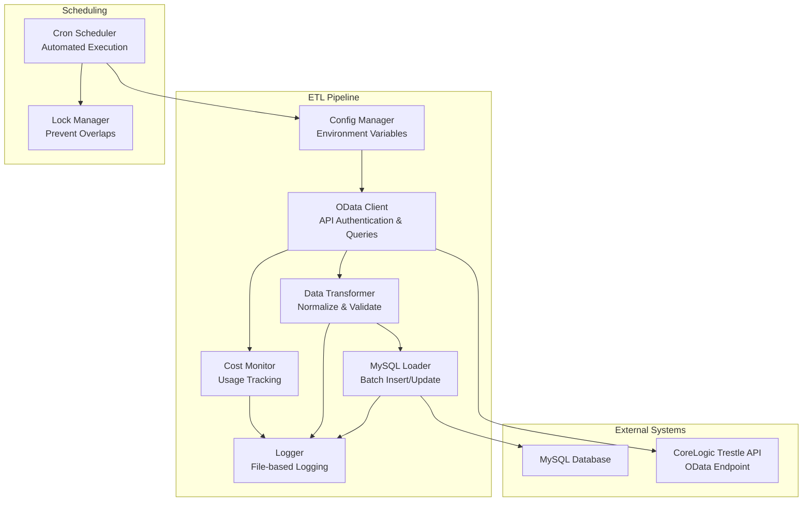

# Design Document: Trestle ETL Pipeline

## Overview

The Trestle ETL Pipeline is a cost-effective Python-based solution that extracts real estate data from CoreLogic's Trestle API and loads it into a MySQL database. The system is designed for simplicity, cost-efficiency, and reliability, using standard Python libraries and cron-based scheduling to minimize infrastructure overhead while maintaining data freshness.

The pipeline leverages the OData protocol's filtering capabilities to minimize bandwidth usage and API costs, implements incremental updates to reduce redundant data transfer, and provides comprehensive logging for monitoring and troubleshooting.

## Architecture



The architecture follows a linear ETL pattern with clear separation of concerns:

- **Configuration Layer**: Manages environment variables and settings
- **Extraction Layer**: Handles API authentication and data retrieval
- **Transformation Layer**: Normalizes and validates data
- **Loading Layer**: Efficiently writes data to MySQL
- **Monitoring Layer**: Tracks costs, performance, and errors
- **Scheduling Layer**: Manages automated execution and prevents overlaps

## Components and Interfaces

### Config Manager
**Purpose**: Centralized configuration management using environment variables
**Key Methods**:
- `load_config()`: Load configuration from .env file
- `get_api_credentials()`: Return API client ID and secret
- `get_database_config()`: Return MySQL connection parameters
- `get_schedule_config()`: Return ETL execution settings

**Configuration Parameters**:
```python
# API Configuration
TRESTLE_CLIENT_ID=your_client_id
TRESTLE_CLIENT_SECRET=your_client_secret
TRESTLE_API_BASE_URL=https://api-prod.corelogic.com/trestle/odata

# Database Configuration  
MYSQL_HOST=localhost
MYSQL_PORT=3306
MYSQL_DATABASE=real_estate
MYSQL_USER=etl_user
MYSQL_PASSWORD=secure_password

# ETL Configuration
BATCH_SIZE=1000
MAX_RETRIES=3
INCREMENTAL_FIELD=ModificationTimestamp
LOG_LEVEL=INFO
```

### OData Client
**Purpose**: Handle authentication and API communication with Trestle
**Key Methods**:
- `authenticate()`: Obtain OAuth2 bearer token (8-hour validity)
- `get_metadata()`: Retrieve API schema information
- `query_properties(filter, select, top, skip)`: Query property data with OData parameters
- `query_media(resource_key)`: Get media URLs for properties
- `handle_pagination()`: Process @odata.nextLink for large result sets
- `check_quota()`: Monitor API usage from response headers

**Authentication Flow**:
```python
# OAuth2 Client Credentials Flow
POST https://api.cotality.com/trestle/oidc/connect/token
Content-Type: application/x-www-form-urlencoded

client_id=your_id&client_secret=your_secret&grant_type=client_credentials&scope=api
```

**OData Query Examples**:
```python
# Get recent properties with specific fields
/trestle/odata/Property?$filter=ModificationTimestamp gt 2024-01-01T00:00:00Z&$select=ListingKey,ListPrice,PropertyType&$top=1000

# Get media for specific property
/trestle/odata/Media?$filter=ResourceRecordKey eq '123456'&$orderby=Order
```

### Data Transformer
**Purpose**: Normalize API data for MySQL storage
**Key Methods**:
- `normalize_field_names()`: Convert API field names to database column names
- `validate_required_fields()`: Ensure critical fields are present
- `convert_data_types()`: Transform API types to MySQL-compatible formats
- `detect_duplicates()`: Identify records for update vs insert
- `sanitize_data()`: Clean and validate data values

**Transformation Rules**:
- Convert OData DateTime to MySQL DATETIME format
- Map RESO field names to database schema conventions
- Handle null values and empty strings appropriately
- Validate numeric ranges and string lengths
- Extract and normalize enumeration values

### MySQL Loader
**Purpose**: Efficiently load transformed data into MySQL
**Key Methods**:
- `create_connection()`: Establish database connection with retry logic
- `batch_insert()`: Insert new records in batches
- `batch_update()`: Update existing records using ON DUPLICATE KEY UPDATE
- `update_sync_metadata()`: Record sync timestamps and counts
- `handle_connection_errors()`: Implement connection retry with exponential backoff

**Database Schema Design**:
```sql
-- Properties table with RESO standard fields
CREATE TABLE properties (
    listing_key VARCHAR(255) PRIMARY KEY,
    list_price DECIMAL(12,2),
    property_type VARCHAR(100),
    bedrooms_total INT,
    bathrooms_total DECIMAL(3,1),
    modification_timestamp DATETIME,
    created_at TIMESTAMP DEFAULT CURRENT_TIMESTAMP,
    updated_at TIMESTAMP DEFAULT CURRENT_TIMESTAMP ON UPDATE CURRENT_TIMESTAMP,
    INDEX idx_modification_timestamp (modification_timestamp),
    INDEX idx_property_type (property_type)
);

-- Sync metadata for tracking ETL runs
CREATE TABLE etl_sync_log (
    id INT AUTO_INCREMENT PRIMARY KEY,
    sync_start DATETIME,
    sync_end DATETIME,
    records_processed INT,
    records_inserted INT,
    records_updated INT,
    api_calls_made INT,
    status ENUM('success', 'partial', 'failed'),
    error_message TEXT,
    created_at TIMESTAMP DEFAULT CURRENT_TIMESTAMP
);
```

### Cost Monitor
**Purpose**: Track API usage and associated costs
**Key Methods**:
- `track_api_call()`: Record API request with quota usage
- `calculate_costs()`: Estimate costs based on usage patterns
- `check_quota_limits()`: Monitor minute/hour quota consumption
- `generate_usage_report()`: Create cost and usage summaries

**Quota Tracking**:
- Monitor `Minute-Quota-Limit` and `Hour-Quota-Limit` headers
- Track API calls vs Media URL requests (different quotas)
- Alert when approaching quota limits
- Implement backoff strategies when quotas are exceeded

### Logger
**Purpose**: Comprehensive logging for monitoring and debugging
**Key Methods**:
- `setup_rotating_logs()`: Configure log rotation and retention
- `log_etl_start()`: Record ETL execution start
- `log_api_response()`: Log API call details and performance
- `log_transformation_stats()`: Record data processing metrics
- `log_database_operations()`: Track insert/update operations
- `log_errors()`: Capture detailed error information

**Log Structure**:
```
logs/
├── etl_main.log          # Main ETL execution log
├── api_calls.log         # API request/response details
├── data_quality.log      # Data validation and transformation issues
├── database.log          # Database operations and performance
└── errors.log            # Error details and stack traces
```

## Data Models

### Property Data Model
Based on RESO Data Dictionary standards:
```python
@dataclass
class Property:
    listing_key: str                    # Unique identifier
    list_price: Optional[Decimal]       # Current listing price
    property_type: Optional[str]        # Residential, Commercial, etc.
    bedrooms_total: Optional[int]       # Total bedrooms
    bathrooms_total: Optional[Decimal]  # Total bathrooms
    square_feet: Optional[int]          # Living area square footage
    lot_size_acres: Optional[Decimal]   # Lot size in acres
    year_built: Optional[int]           # Year property was built
    listing_status: Optional[str]       # Active, Pending, Sold, etc.
    modification_timestamp: datetime    # Last modified date
    street_address: Optional[str]       # Property address
    city: Optional[str]                 # City name
    state_or_province: Optional[str]    # State/Province
    postal_code: Optional[str]          # ZIP/Postal code
    
    def to_dict(self) -> Dict[str, Any]:
        """Convert to dictionary for database insertion"""
        
    @classmethod
    def from_api_response(cls, api_data: Dict) -> 'Property':
        """Create Property from Trestle API response"""
```

### Media Data Model
```python
@dataclass
class Media:
    media_key: str                      # Unique media identifier
    resource_record_key: str            # Links to Property.listing_key
    media_url: str                      # URL to download media
    media_type: str                     # Photo, Video, Document
    order: int                          # Display order
    modification_timestamp: datetime    # Last modified date
    
    def download_media(self) -> bytes:
        """Download media content from URL"""
```

### Sync Metadata Model
```python
@dataclass
class SyncRun:
    sync_id: int
    sync_start: datetime
    sync_end: Optional[datetime]
    records_processed: int
    records_inserted: int
    records_updated: int
    api_calls_made: int
    status: str                         # success, partial, failed
    error_message: Optional[str]
    last_sync_timestamp: Optional[datetime]  # For incremental updates
```

## Correctness Properties

*A property is a characteristic or behavior that should hold true across all valid executions of a system—essentially, a formal statement about what the system should do. Properties serve as the bridge between human-readable specifications and machine-verifiable correctness guarantees.*

Now I need to analyze the acceptance criteria from the requirements to create correctness properties. Let me use the prework tool:

<function_calls>
<invoke name="prework">
<parameter name="featureName">trestle-etl-pipeline

Based on the prework analysis and after eliminating redundant properties, the following correctness properties ensure the system behaves correctly across all valid inputs:

### Property 1: Authentication Success and Failure Handling
*For any* set of API credentials, the authentication process should succeed with valid credentials and fail gracefully with invalid credentials, returning appropriate error messages.
**Validates: Requirements 1.1**

### Property 2: OData Query Construction
*For any* combination of field selections and filters, the OData client should construct syntactically correct OData URLs that include all specified parameters in the proper format.
**Validates: Requirements 1.2**

### Property 3: Exponential Backoff Retry Logic
*For any* rate limit or connection failure scenario, retry attempts should follow exponential backoff timing patterns with configurable maximum attempts.
**Validates: Requirements 1.3, 3.5, 5.3**

### Property 4: Response Validation and Error Handling
*For any* API response format (valid or invalid), the system should correctly validate the response structure and handle errors without crashing.
**Validates: Requirements 1.4**

### Property 5: Pagination Completeness
*For any* paginated API response set, all pages should be processed and no records should be skipped or duplicated during pagination.
**Validates: Requirements 1.5**

### Property 6: Field Name Normalization Consistency
*For any* API field name, the transformation to MySQL column names should be consistent, reversible, and produce valid SQL identifiers.
**Validates: Requirements 2.1**

### Property 7: Data Validation and Processing Continuation
*For any* dataset containing both valid and invalid records, the system should validate all records, log errors for invalid ones, and continue processing all valid records.
**Validates: Requirements 2.2, 2.3, 3.3**

### Property 8: Data Type Conversion Accuracy
*For any* API data type, the conversion to MySQL-compatible format should preserve data integrity and handle edge cases appropriately.
**Validates: Requirements 2.4**

### Property 9: Duplicate Detection Consistency
*For any* dataset with known duplicates, the duplicate detection algorithm should consistently identify the same records as duplicates across multiple runs.
**Validates: Requirements 2.5**

### Property 10: Batch Operation Usage
*For any* data loading operation, the system should use batch SQL operations rather than individual insert/update statements when the batch size exceeds the configured threshold.
**Validates: Requirements 3.1**

### Property 11: Upsert Behavior Correctness
*For any* record loaded multiple times, the database should contain exactly one instance of that record with the most recent data.
**Validates: Requirements 3.2**

### Property 12: Metadata Tracking Accuracy
*For any* completed ETL run, the sync metadata should accurately reflect the number of records processed, inserted, updated, and the execution duration.
**Validates: Requirements 3.4**

### Property 13: Incremental Update Efficiency
*For any* ETL run after the initial load, only records modified since the last successful sync timestamp should be requested from the API.
**Validates: Requirements 4.2, 4.3**

### Property 14: Quota Monitoring and Alerting
*For any* API usage pattern that approaches quota limits, the cost monitor should trigger appropriate alerts and optionally pause operations.
**Validates: Requirements 4.4**

### Property 15: Request Batching Efficiency
*For any* ETL scenario requiring multiple data types, the number of API calls should be minimized through efficient request batching.
**Validates: Requirements 4.5**

### Property 16: Execution Lock Prevention
*For any* attempt to run overlapping ETL executions, only the first instance should proceed while subsequent attempts should exit gracefully.
**Validates: Requirements 5.2**

### Property 17: Comprehensive Logging Coverage
*For any* ETL operation, all significant events, errors, and performance metrics should be logged to appropriate log files with proper rotation.
**Validates: Requirements 5.4, 6.1, 6.2, 6.3**

### Property 18: Cost Tracking Accuracy
*For any* API usage, the cost monitor should accurately track and report usage statistics including API calls and estimated costs.
**Validates: Requirements 6.4**

### Property 19: Alert Delivery Reliability
*For any* critical error condition, configured alert mechanisms (email, webhook) should successfully deliver notifications.
**Validates: Requirements 6.5**

### Property 20: Configuration Loading Completeness
*For any* valid configuration environment, all required settings should be loaded correctly and invalid configurations should be rejected with clear error messages.
**Validates: Requirements 7.1, 7.2, 7.3, 7.4**

## Error Handling

The system implements comprehensive error handling at multiple levels:

### API Level Errors
- **Authentication failures**: Retry with exponential backoff, alert on persistent failures
- **Rate limit exceeded (429)**: Implement exponential backoff based on quota headers
- **Server errors (5xx)**: Retry with backoff, log detailed error information
- **Network timeouts**: Configurable timeout with retry logic
- **Invalid responses**: Validate JSON structure, handle malformed data gracefully

### Data Processing Errors
- **Missing required fields**: Log error, skip record, continue processing
- **Data type conversion failures**: Log error with context, use default values where appropriate
- **Duplicate key violations**: Handle as upserts, log for monitoring
- **Data validation failures**: Log detailed validation errors, quarantine invalid records

### Database Errors
- **Connection failures**: Implement connection pooling with retry logic
- **Transaction failures**: Rollback and retry with smaller batch sizes
- **Constraint violations**: Log violations, attempt data correction where possible
- **Disk space issues**: Alert immediately, pause operations if critical

### System Level Errors
- **Memory constraints**: Implement streaming processing, reduce batch sizes
- **Disk space issues**: Implement log rotation, alert on low space
- **Permission errors**: Clear error messages with resolution guidance
- **Configuration errors**: Validate configuration on startup, fail fast with clear messages

## Testing Strategy

The testing strategy employs a dual approach combining unit tests for specific scenarios and property-based tests for comprehensive coverage:

### Property-Based Testing
Property-based tests will be implemented using the **Hypothesis** library for Python, which generates random test inputs to validate universal properties. Each correctness property will be implemented as a separate property-based test with minimum 100 iterations per test.

**Test Configuration**:
- **Library**: Hypothesis for Python
- **Iterations**: Minimum 100 per property test
- **Test Tags**: Each test tagged with format: **Feature: trestle-etl-pipeline, Property {number}: {property_text}**

**Property Test Examples**:
```python
@given(field_names=st.lists(st.text(min_size=1, max_size=50)))
def test_field_name_normalization_consistency(field_names):
    """Feature: trestle-etl-pipeline, Property 6: Field Name Normalization Consistency"""
    transformer = DataTransformer()
    normalized = [transformer.normalize_field_name(name) for name in field_names]
    # Test that normalization is consistent and produces valid SQL identifiers
    assert all(is_valid_sql_identifier(name) for name in normalized)

@given(credentials=st.tuples(st.text(), st.text()))
def test_authentication_handling(credentials):
    """Feature: trestle-etl-pipeline, Property 1: Authentication Success and Failure Handling"""
    client_id, client_secret = credentials
    client = ODataClient()
    # Test authentication behavior with various credential combinations
    result = client.authenticate(client_id, client_secret)
    # Verify appropriate success/failure handling
```

### Unit Testing
Unit tests focus on specific examples, edge cases, and integration points:

**Core Unit Tests**:
- **Configuration loading**: Test various environment variable combinations
- **API client methods**: Test specific API endpoints and response handling
- **Data transformation**: Test specific field mappings and data type conversions
- **Database operations**: Test connection handling and SQL generation
- **Error scenarios**: Test specific error conditions and recovery

**Integration Tests**:
- **End-to-end ETL flow**: Test complete pipeline with mock data
- **Database schema compatibility**: Verify data model matches database schema
- **Configuration profiles**: Test different environment configurations
- **Logging integration**: Verify log output format and rotation

**Test Data Management**:
- Use factory patterns for generating test data
- Mock external API responses for consistent testing
- Use in-memory databases for fast unit tests
- Maintain separate test configuration profiles

The combination of property-based tests for universal correctness and unit tests for specific scenarios ensures comprehensive coverage while maintaining fast feedback cycles during development.